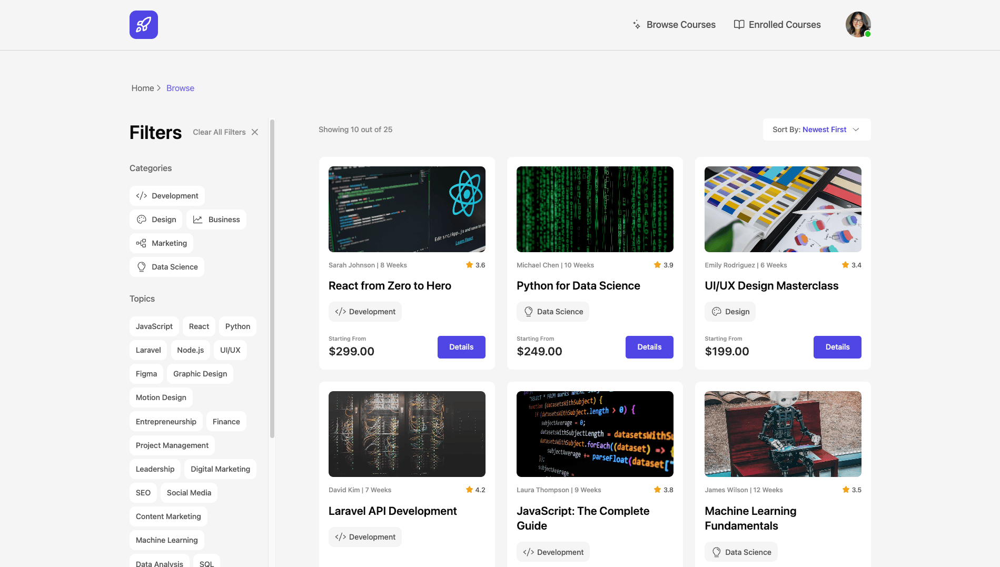
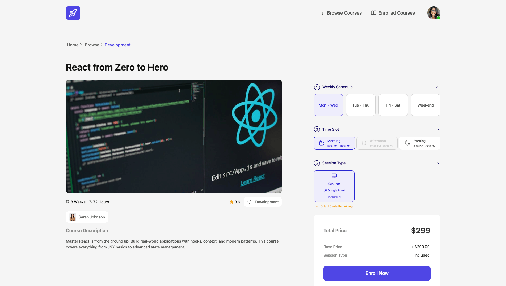
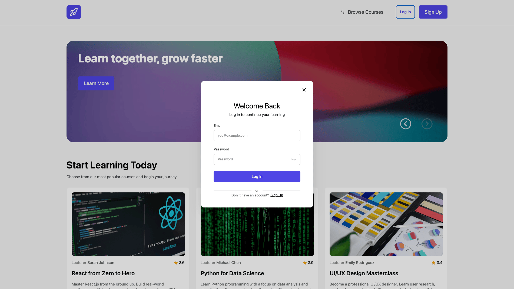

# Courses Website

A modern web application for discovering and managing educational courses. This platform allows users to browse available courses, manage their learning profile, and track their educational progress.

### Table of Contents

- [Key Features](#Key-Features)
- [Tech Stack](#tech-stack)
- [Resources](#resources)
- [Getting Started](#getting-started)
- [Screenshots](#screenshots)

### Key Features

- **Course Browsing**: Explore a variety of courses with detailed information.
- **Advanced Authentication**: Secure multi-step registration and login system.
- **Profile Management**: Customizable user profiles including avatar uploads, age verification, and contact details.
- **Live Form Validation**: Real-time feedback for user inputs using custom composables.
- **Course Enrollment**: Functionality to track and manage in-progress courses.

### Tech Stack

- [Vue 3](https://vuejs.org/) – The Progressive JavaScript Framework (Composition API)
- [Vite](https://vitejs.dev/) – Next Generation Frontend Tooling
- [Pinia](https://pinia.vuejs.org/) – Intuitive state management for Vue
- [TypeScript](https://www.typescriptlang.org/) – Static typing for better developer experience
- [Tailwind CSS](https://tailwindcss.com/) – Utility-first CSS framework
- [Axios](https://axios-http.com/) – Promise based HTTP client

### Resources

- [Assignment](https://redberry.gitbook.io/redberry-bootcamp-xi-assignment/eBd6HTCFN8WQC3Na5iEE)
- [Figma](https://www.figma.com/design/iiROqSOgV7dlVlgqEoxk09/Redberry-Bootcamp-XI?node-id=1193-6070&t=WFpOEhyjNEraiXcH-0)

### Getting Started

1\. Clone the repository to your local machine

```sh
https://github.com/Daniel160407/Courses-Redberry
```

3\. Run npm install to install the dependencies

```sh
npm install
```

4\. Run npm install axios, npm install js-cookie and npm install tailwindcss @tailwindcss/vite

```sh
npm install axios
npm install js-cookie
npm install tailwindcss @tailwindcss/vite
npm install pinia
npm install vue-router
```

5\. Run npm run dev to start the server

```sh
npm run dev
```

### Screenshots







